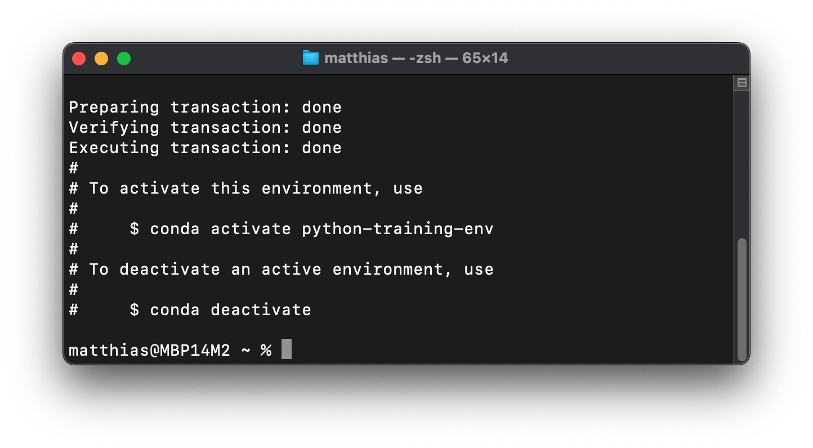

# Setting up your computer

This chapter provides instructions for setting up your computer before the training.

## Setting up Python and Conda

This guide will help you set up your computer with Conda / Miniconda, a useful tool for managing Python environments.

### What is Conda and Miniconda?

__Conda__ is an open-source package management and environment management system for Python.
It allows you to quickly create and manage multiple isolated environments,
each with its own set of Python version and packages.
Conda also helps to install, run, and update packages and their dependencies.
Conda is popular for its ease of use, powerful capabilities, and it's available for Windows, macOS, and Linux.

__Miniconda__ is a lightweight version of Anaconda, a popular full-scale Conda-based Python distribution for Data Science.
While Anaconda comes with many pre-installed packages (which can be large),
Miniconda includes only Conda and its core dependencies, allowing you to install only the packages you really need.
Miniconda will take up about 400 MB of disk space.

### Setting Up Miniconda

Follow these steps to install Miniconda on your computer:

1. _Download Miniconda_:
   * Visit the [Miniconda download page](https://docs.anaconda.com/free/miniconda/miniconda-install/) 
   * Choose and download the appropriate (graphical) installer for your operating system (Windows, macOS, or Linux), with the latest release of Python in version 3.12

2. _Install Miniconda_:
   * Run the installer and follow the instructions from the download page as well as the on-screen instructions. For most users, the default settings will be suitable.
   * During the installation, and depending on your operating system, you may be prompted to initialize Conda and/or to add Conda to the PATH variable. 
   * Accepting this option (even if it says that this is not recommended) will set up Conda in your system's PATH, making it easier to use from the command line.

3. _Verify the Installation_:
   * Open a terminal or command prompt.
   * Type `conda --version` and press Enter. 
   * You should see the Conda version number (like in the screenshot), indicating that the installation was successful.


### Prepare a Conda environment for the training

#### What is a Conda Environment?

A Conda environment is an isolated space on your system where you can install specific versions of Python and Python packages
without affecting other projects and software on your computer.
This isolation helps to manage Python versions, packages, and dependencies and avoid conflicts between different projects.
To set up such an environment with a predefined set of packages, a so-called conda environment file can be used. 
Such files are written in [YAML](https://en.wikipedia.org/wiki/YAML), a human-readable data serialization language.

#### How is an environment file used?

A YAML environment file is used to automate the creation of Conda environments.
Instead of manually installing packages one by one, you list all necessary packages and their versions in the YAML file.
Conda reads this file and sets up the environment accordingly. 
We provide the needed file, please download it [here](python-conda-env.yml).

#### Create a new Conda environment with the given file

Make sure to run the terminal where the file is located or provide the full path to the downloaded file.

```
conda env create -f python-conda-env.yml
```

This will download all the defined packages into the newly created Conda environment with Python in version 3.12.
You should end up with a success message similar to the screenshot below:



Then, check whether the new environment is listed via:

```
conda env list
```

This should show at least two installed environments with their respective paths in your file system:
* base
* python-training-env

__If everything worked out so far, you are done and prepared for the training.__